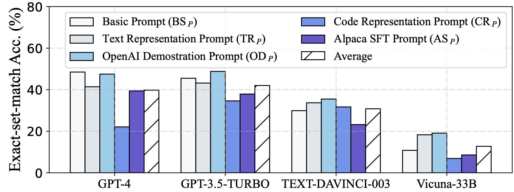
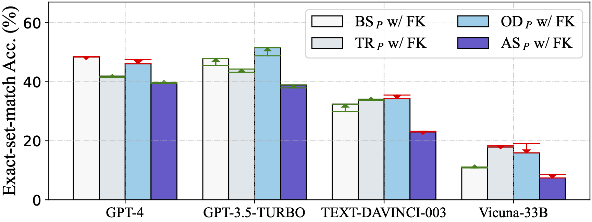
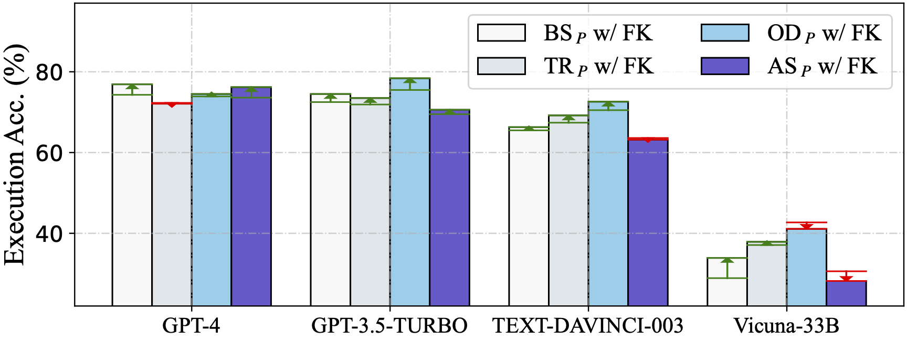
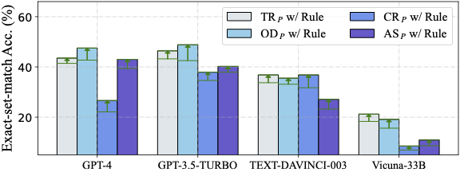
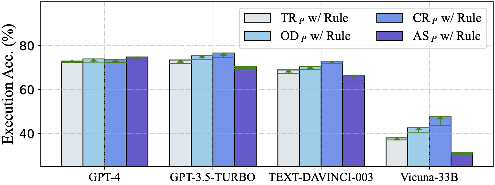
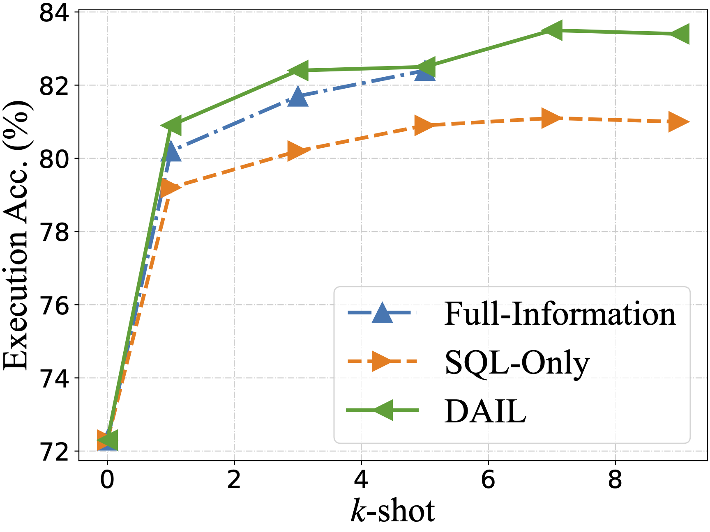
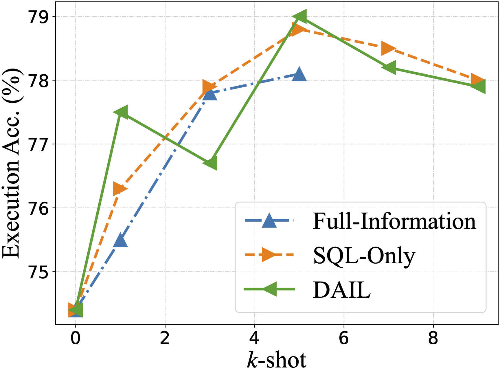
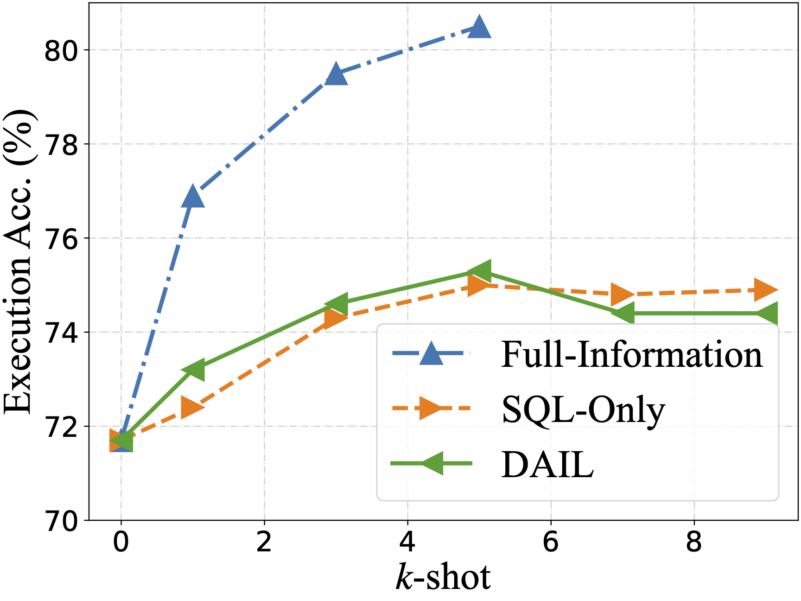
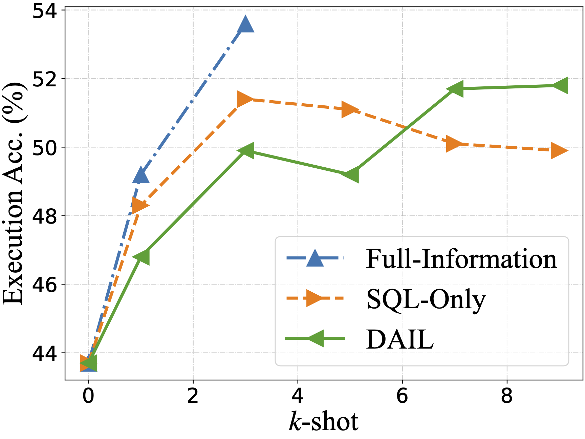

# DAIL-SQL

DAIL-SQL is a highly effective and efficient approach for optimizing the utilization of LLM on Text-to-SQL.
It has proven its superiority by achieving a remarkable score of 86.2% on the Spider leaderboard using GPT-4 during testing.
Notably, it only requires approximately 1600 tokens per question in Spider-dev.
In addition to this, we have achieved an even higher score of 86.6% on Spider-test through self-consistency voting of GPT-4.

>Dawei Gao, Haibin Wang, Yaliang Li, Xiuyu Sun, Yichen Qian, Bolin Ding and Jingren Zhou.
Text-to-SQL Empowered by Large Language Models: A Benchmark Evaluation.
CoRR abs/2308.15363 (2023).

Paper link: [arXiv](https://arxiv.org/abs/2308.15363)

## Overview

To provide a systematical and in-depth understanding of Text-to-SQL prompt engineering, we empirically evaluate several strategies from prior studies.
First, we compare several typical question representations in zero-shot scenario with different LLMs, and identify their pros and cons.
After that, we investigate example selection and organization strategies in few-shot scenario.
For example selection, we compare different selection strategies and further verify the hypothesis that LLMs learn from the mappings between question and SQL skeleton.
Regarding example organization, we explore the option of displaying full information, solely SQL queries or question-SQL pair.

Last but not least, our integrated solution, named DAIL-SQL, refreshes the Spider leaderboard with 86.6% execution accuracy, and wins the first place.
Compared with previous solutions, DAIL-SQL encodes structure knowledge as SQL statements, selects examples based on their skeleton similarities and removes cross-domain knowledge from examples for token efficiency.

## Environment Setup
To set up the environment, you should download the [stanford-cornlp](http://nlp.stanford.edu/software/stanford-corenlp-full-2018-10-05.zip) and unzip it to the folder `./third_party`.
Next, you need to launch the coreNLP server:
```coreNLP
apt install default-jre
apt install default-jdk
cd third_party/stanford-corenlp-full-2018-10-05
nohup java -mx4g -cp "*" edu.stanford.nlp.pipeline.StanfordCoreNLPServer &
cd ../../
```
In addition, set up the Python environment:
```python_env
conda create -n DAIL-SQL python=3.8
conda activate DAIL-SQL
python -m pip install --upgrade pip
pip install -r requirements.txt
python nltk_downloader.py
```

## Data Preparation
You need to download the [Spider](https://yale-lily.github.io/spider) to the folder `./dataset/spider`.

## Run

### Data Preprocess
```
python data_preprocess.py
```
### Prompt Generation
Select examples with masked question similarity:
```
python generate_question.py \
--data_type spider \
--split test \
--tokenizer gpt-3.5-turbo \
--max_seq_len 4096 \
--prompt_repr SQL \
--k_shot 9 \
--example_type QA \
--selector_type  EUCDISQUESTIONMASK
```
Select examples considering both question similarity and query similarity:
```
python generate_question.py \
--data_type spider \
--split test \
--tokenizer gpt-3.5-turbo \
--max_seq_len 4096 \
--selector_type EUCDISMASKPRESKLSIMTHR \
--pre_test_result [your_pre_generated_queries_file] \
--prompt_repr SQL \
--k_shot 9 \
--example_type QA
```

### Calling the LLM
Without voting:
```
python ask_llm.py \
--openai_api_key [your_openai_api_key]  \
--model gpt-4 \
--question [prompt_dir]
```
With self-consistency voting:
```
python ask_llm.py \
--openai_api_key [your_openai_api_key]  \
--model gpt-4 \
--question [prompt_dir] \
--n 5 \
--db_dir ./dataset/spider/database \
--temperature 1.0
```

### Running Example
```
bash run_dail_sql_mini.sh [your_openai_api_key]
```

## Experiments

In our works, we systematically study prompt engineering for LLM-based Text-to-SQL methods, 
including five question representations, two prompt components, four example selections, and three example organizations on four LLMs. 
The study sheds light on identifying suitable question representations and key points to leverage the in-context learning capacity of LLMs for Text-to-SQL task.
We present our experimental results in the Spider train split. 
Here, we take [Graphix](https://github.com/AlibabaResearch/DAMO-ConvAI/tree/main/graphix) as our preliminary model to pre-generate the SQL query for acquiring query similarity.
Please refer to the [Test Suites](https://github.com/taoyds/test-suite-sql-eval) for evaluation metrics.

### Question Representations
We evaluate five question representations summarized from other works under zero-shot scenario, 
employing four LLMs: GPT-4, GPT-3.5-TURBO, TEXT-DAVINCI-003, and Vicuna-33B. We find Code Representation Prompt and OpenAI Demostration Prompt are preferred.
<br>
<div align="center"></div>
<br>
We also investigate the impact of foreign key and "with no explanation" rule implication. Both the foreign key and the "with no explanation" rule implication
are beneficial for Text-to-SQL task.
<br>
<div align="center"></div>
<div align="center"></div>
<br>

### Example Selections

We then study the effects of different example selections under few-shot scenario. 
We emphasize the importance to consider both question similarity and query similarity as DAIL-SQL does in example selection.

<table>
    <tr>
        <td rowspan="2">Few-shot</td>
        <td rowspan="2">Selection</td>
        <td rowspan="2">Question<br>Similarity</td>
        <td rowspan="2">Query<br>Similarity</td>
        <td colspan="2">GPT-4</td>
        <td colspan="2">GPT-3.5-TURBO</td>
        <td colspan="2">TEXT-DAVINCI-003</td>
        <td colspan="2">Vicuna-33B</td>
    </tr>
    <tr>
        <td> EM </td>
        <td> EX </td>
        <td> EM </td>
        <td> EX </td>
        <td> EM </td>
        <td> EX </td>
        <td> EM </td>
        <td> EX </td>
    </tr>
    <tr>
        <td> 0-shot </td>
        <td> - </td>
        <td> - </td>
        <td> - </td>
        <td> 22.1 </td>
        <td> 72.3 </td>
        <td> 34.6 </td>
        <td> 74.4 </td>
        <td> 31.7 </td>
        <td> 71.7 </td>
        <td> 6.9 </td>
        <td> 43.7 </td>
    </tr>
    <tr>
        <td rowspan="4"> 1-shot </td>
        <td> Random </td>
        <td> 0.23 </td>
        <td> 0.47 </td>
        <td> 41.7 </td>
        <td> 77.4 </td>
        <td> 45.9 </td>
        <td> 73.9 </td>
        <td> 38.2 </td>
        <td> 70.6 </td>
        <td> 14.4 </td>
        <td> 47.9 </td>
    </tr>
    <tr>
        <td> Question Similarity Selection </td>
        <td> 0.39 </td>
        <td> 0.65 </td>
        <td> 53.3 </td>
        <td> 78.8 </td>
        <td> 51.9 </td>
        <td> 74.3 </td>
        <td> 44.1 </td>
        <td> 72.3 </td>
        <td> 16.5 </td>
        <td> 48.5 </td>
    </tr>
    <tr>
        <td> Masked Question Similarity Selection </td>
        <td> 0.57 </td>
        <td> 0.80 </td>
        <td> 58.2 </td>
        <td> 79.1 </td>
        <td> 57.4 </td>
        <td> 76.0 </td>
        <td> 47.9 </td>
        <td> 75.0 </td>
        <td> 21.4 </td>
        <td> 48.7 </td>
    </tr>
    <tr>
        <td> DAIL Selection </td>
        <td> 0.56 </td>
        <td> 0.95 </td>
        <td> 62.1 </td>
        <td> 80.2 </td>
        <td> 59.5 </td>
        <td> 75.5 </td>
        <td> 51.9 </td>
        <td> 76.9 </td>
        <td> 22.8 </td>
        <td> 49.2 </td>
    </tr>
    <tr>
        <td rowspan="4"> 3-shot </td>
        <td> Random </td>
        <td> 0.23 </td>
        <td> 0.48 </td>
        <td> 48.9 </td>
        <td> 79.4 </td>
        <td> 49.0 </td>
        <td> 73.6 </td>
        <td> 41.7 </td>
        <td> 71.6 </td>
        <td> 16.8 </td>
        <td> 46.9 </td>
    </tr>
    <tr>
        <td> Question Similarity Selection </td>
        <td> 0.37 </td>
        <td> 0.63 </td>
        <td> 56.3 </td>
        <td> 79.2 </td>
        <td> 53.8 </td>
        <td> 74.7 </td>
        <td> 52.2 </td>
        <td> 74.1 </td>
        <td> 21.1 </td>
        <td> 47.1 </td>
    </tr>
    <tr>
        <td> Masked Question Similarity Selection </td>
        <td> 0.54 </td>
        <td> 0.78 </td>
        <td> 66.1 </td>
        <td> 81.5 </td>
        <td> 61.1 </td>
        <td> 77.3 </td>
        <td> 59.7 </td>
        <td> 77.0 </td>
        <td> 27.7 </td>
        <td> 52.3 </td>
    </tr>
    <tr>
        <td> DAIL Selection </td>
        <td> 0.53 </td>
        <td> 0.94 </td>
        <td> 69.1 </td>
        <td> 81.7 </td>
        <td> 63.9 </td>
        <td> 77.8 </td>
        <td> 64.4 </td>
        <td> 79.5 </td>
        <td> 30.7 </td>
        <td> 53.6 </td>
    </tr>
    <tr>
        <td rowspan="4"> 5-shot </td>
        <td> Random </td>
        <td> 0.23 </td>
        <td> 0.48 </td>
        <td> 51.6 </td>
        <td> 79.5 </td>
        <td> 52.9 </td>
        <td> 75.7 </td>
        <td> 49.0 </td>
        <td> 72.1 </td>
        <td> - </td>
        <td> - </td>
    </tr>
    <tr>
        <td> Question Similarity Selection </td>
        <td> 0.36 </td>
        <td> 0.61 </td>
        <td> 58.2 </td>
        <td> 79.9 </td>
        <td> 55.9 </td>
        <td> 75.1 </td>
        <td> 54.8 </td>
        <td> 73.2 </td>
        <td> - </td>
        <td> - </td>
    </tr>
    <tr>
        <td> Masked Question Similarity Selection </td>
        <td> 0.52 </td>
        <td> 0.77 </td>
        <td> 66.8 </td>
        <td> 82.0 </td>
        <td> 62.3 </td>
        <td> 77.9 </td>
        <td> 64.7 </td>
        <td> 78.6 </td>
        <td> - </td>
        <td> - </td>
    </tr>
    <tr>
        <td> DAIL Selection </td>
        <td> 0.52 </td>
        <td> 0.94 </td>
        <td> 71.9 </td>
        <td> 82.4 </td>
        <td> 66.7 </td>
        <td> 78.1 </td>
        <td> 67.7 </td>
        <td> 80.5 </td>
        <td> - </td>
        <td> - </td>
    </tr>

</table>

### Example Organizations

Finally, we examine example organizations in DAIL-SQL, 
excluding the token-cost database schema in the examples and only presenting question and query pairs to LLMs. 
In our analysis, we contrast the DAIL-SQL organization with both Full-Information and SQL-Only organizations, 
finding that the DAIL organization is a highly effective and efficient approach for potent LLMs.

<table>
    <tr>
        <td align="center"><br />GPT-4</td>
        <td align="center"><br />GPT-3.5-TURBO</td>
    </tr>
    <tr>
        <td align="center"><br />TEXT-DAVINCI-003</td>
        <td align="center"><br />Vicuna-33B</td>
    </tr>
</table>

## Evaluation of DAIL-SQL
In evaluation, we take GPT-4 itself as the preliminary model for acquiring query similarity. 
The commands are shown in `run_dail_sql.sh` and `run_dail_sql_with_sc.sh`.
| Method    | Dev EM    | Dev EX    | Test EM   | Test EX   |
| --------- | --------- | --------- | --------- | --------- |
| DAIL-SQL+GPT-4    | 70.0  | 83.1  | 66.5  | 86.2  |
| DAIL-SQL+GPT-4+Self-consistency   | 68.7  | 83.6  | 66.0  | 86.6  |

## Bibtex
If DAIL-SQL is useful for you, please consider to cite it. Thank you! :)
```bit_tex
@article{dail_sql,
    author  =   {Dawei Gao and
    Haibin Wang and
    Yaliang Li and
    Xiuyu Sun and
    Yichen Qian and
    Bolin Ding and
    Jingren Zhou},
    title   =   {Text-to-SQL Empowered by Large Language Models: A Benchmark Evaluation},
    journal =   {CoRR},
    volume  =   {abs/2308.15363},
    year    =   {2023}
}
```

## Acknowledgements

The codes of schema-linking are inspired by [RAT-SQL](https://github.com/microsoft/rat-sql/tree/master).

The codes of self-consistency voting are inspired by [C3SQL](https://github.com/bigbigwatermalon/C3SQL).
